# Multi-Campus Subnet-Based University Network Architecture

---

## Network Topology

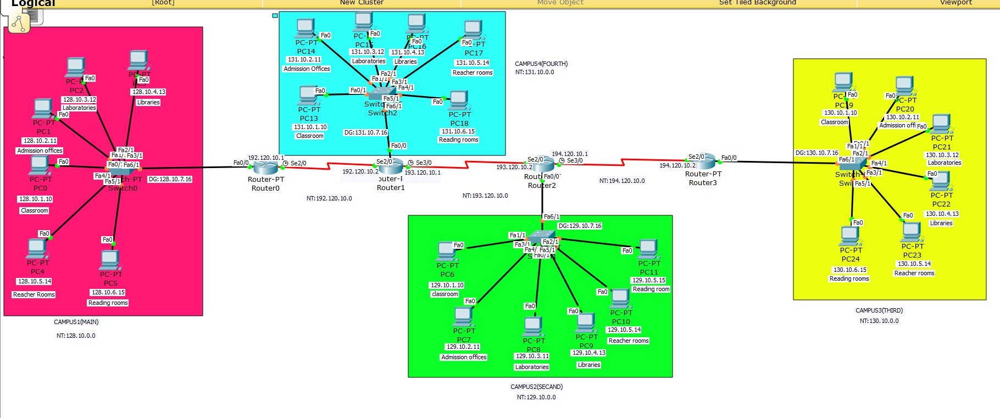

Linear chain topology:
`Router0 (Main) ↔ Router1 (North) ↔ Router2 (South) ↔ Router3 (East)`

Each router connects to its own campus switch + host machines. Inter-router links use **Serial interfaces** at **64000 bps** clock rate (DCE side).

---

## IP Addressing Scheme

### LAN Subnets (Class B)

| Campus | Network | Subnet Mask | Gateway |
|--------|---------|-------------|---------|
| Campus1 — Main (R0) | 128.10.0.0 | 255.255.0.0 | 128.10.7.16 |
| Campus2 — Second (R1) | 131.10.0.0 | 255.255.0.0 | 131.10.7.16 |
| Campus3 — Third (R2) | 129.10.0.0 | 255.255.0.0 | 129.10.7.16 |
| Campus4 — Fourth (R3) | 130.10.0.0 | 255.255.0.0 | 130.10.7.16 |

### WAN Links (Class C)

| Link | Network | Router A IP | Router B IP |
|------|---------|-------------|-------------|
| R0 ↔ R1 | 192.120.10.0/24 | 192.120.10.1 | 192.120.10.2 |
| R1 ↔ R2 | 193.120.10.0/24 | 193.120.10.1 | 193.120.10.2 |
| R2 ↔ R3 | 194.120.10.0/24 | 194.120.10.1 | 194.120.10.2 |

---

## Static Routing Configuration

### Router0 — Campus1(MAIN)

| Destination | Mask | Next Hop |
|-------------|------|----------|
| 193.120.10.0 | 255.255.255.0 | 192.120.10.2 |
| 194.120.10.0 | 255.255.255.0 | 192.120.10.2 |
| 129.10.0.0 | 255.255.0.0 | 192.120.10.2 |
| 130.10.0.0 | 255.255.0.0 | 192.120.10.2 |
| 131.10.0.0 | 255.255.0.0 | 192.120.10.2 |

### Router1 — Campus2(SECOND)

| Destination | Mask | Next Hop |
|-------------|------|----------|
| 128.10.0.0 | 255.255.0.0 | 192.120.10.1 |
| 194.120.10.0 | 255.255.255.0 | 193.120.10.2 |
| 129.10.0.0 | 255.255.0.0 | 193.120.10.2 |
| 130.10.0.0 | 255.255.0.0 | 193.120.10.2 |
| 193.120.10.0 | 255.255.255.0 | 193.120.10.2 |

### Router2 — Campus3(THIRD)

| Destination | Mask | Next Hop |
|-------------|------|----------|
| 192.120.10.0 | 255.255.255.0 | 193.120.10.1 |
| 128.10.0.0 | 255.255.0.0 | 193.120.10.1 |
| 131.10.0.0 | 255.255.0.0 | 193.120.10.1 |
| 130.10.0.0 | 255.255.0.0 | 194.120.10.2 |

### Router3 — Campus4(FOURTH)

| Destination | Mask | Next Hop |
|-------------|------|----------|
| 192.120.10.0 | 255.255.255.0 | 194.120.10.1 |
| 193.120.10.0 | 255.255.255.0 | 194.120.10.1 |
| 128.10.0.0 | 255.255.0.0 | 194.120.10.1 |
| 129.10.0.0 | 255.255.0.0 | 194.120.10.1 |
| 131.10.0.0 | 255.255.0.0 | 194.120.10.1 |

---

## Router CLI Configuration Screenshots

### Router0 — Campus1(MAIN)

**Figure 1:** FastEthernet0/0 LAN interface (128.10.7.16/16)

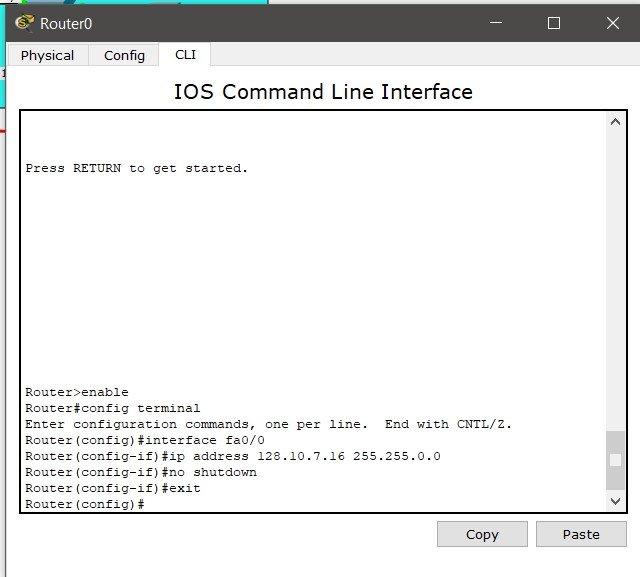

**Figure 2:** Serial2/0 WAN interface (192.120.10.1)

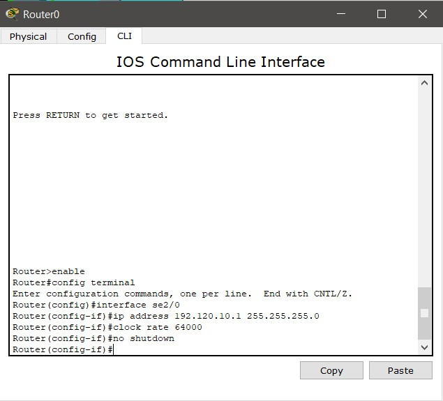

**Figure 3:** Static route entries

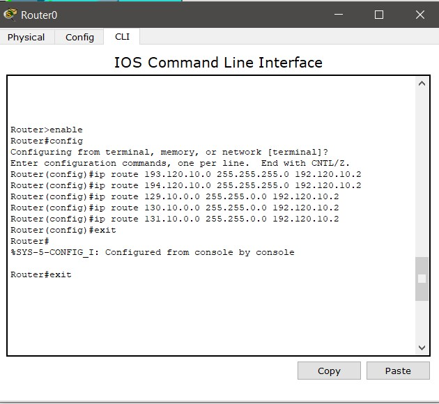

---

### Router1 — Campus2(SECOND)

**Figure 4:** FastEthernet0/0 LAN interface (131.10.7.16/16)

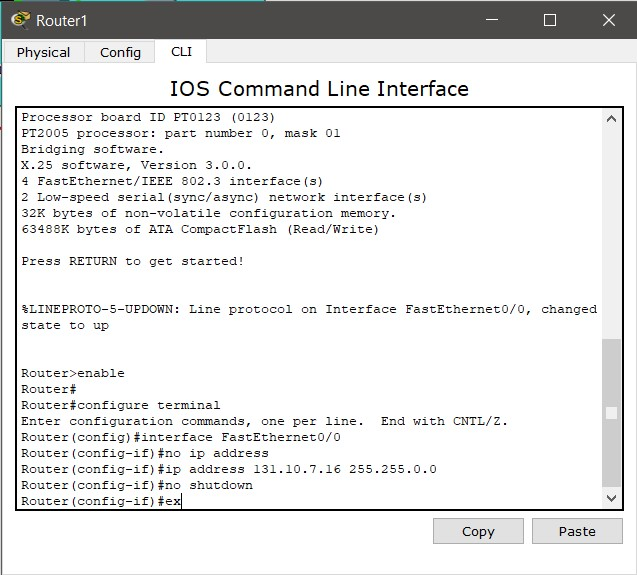

**Figure 5:** Serial3/0 WAN interface (193.120.10.1)

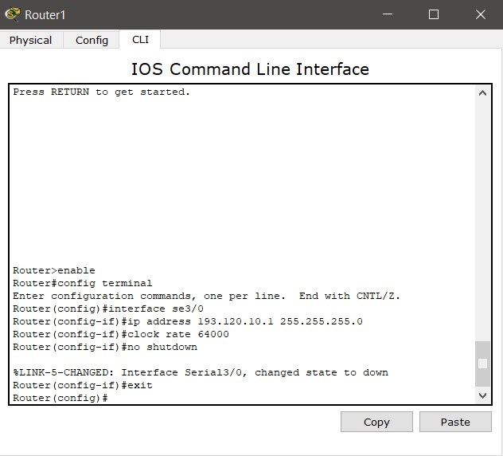

**Figure 6:** Static route entries

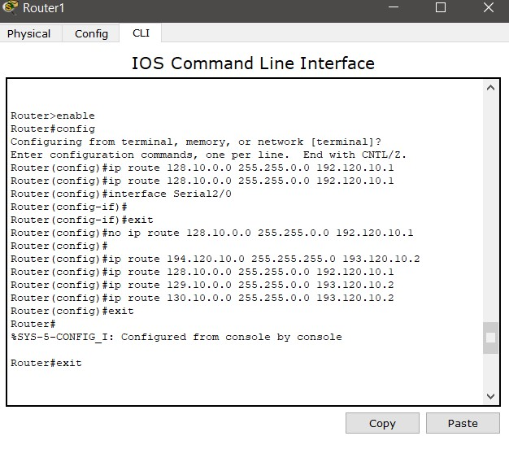

---

### Router2 — Campus3(THIRD)

**Figure 7:** FastEthernet0/0 LAN interface (129.10.7.16/16)

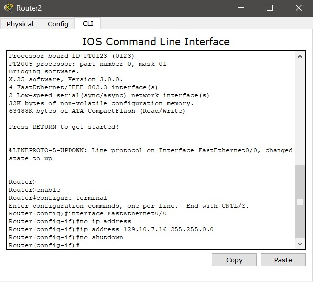

**Figure 8:** Serial2/0 WAN interface (193.120.10.2)

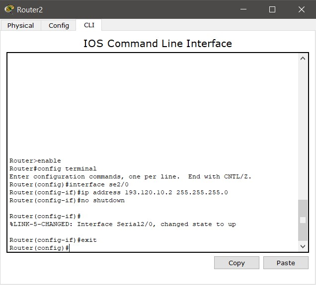

**Figure 9:** Serial3/0 WAN interface (194.120.10.1)

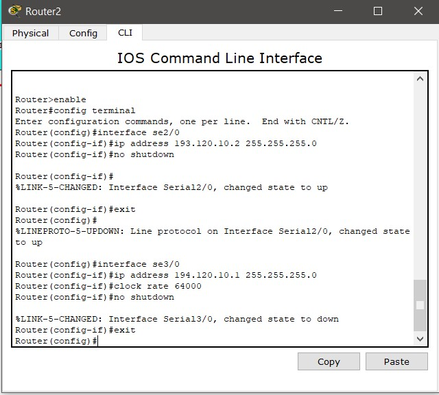

**Figure 10:** Static route entries

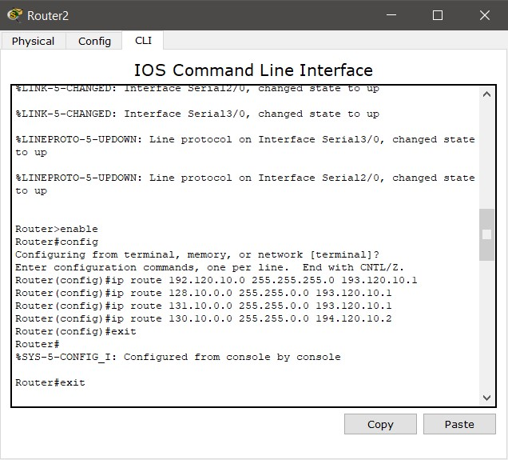

---

### Router3 — Campus4(FOURTH)

**Figure 11:** FastEthernet0/0 LAN interface (130.10.7.16/16)

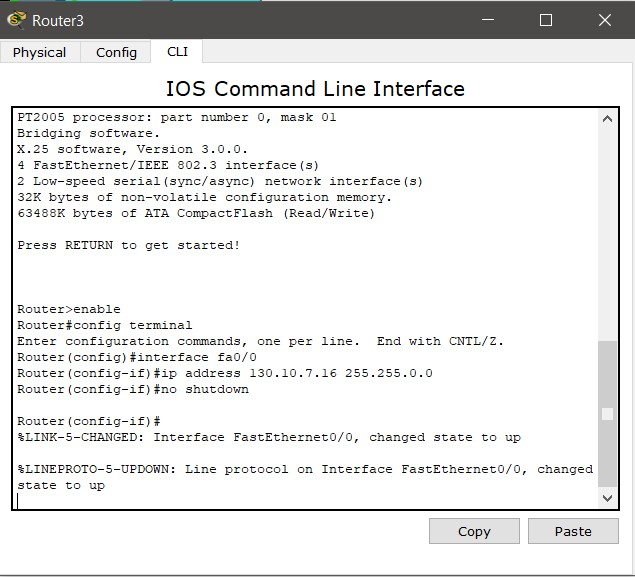

**Figure 12:** Serial2/0 WAN interface (194.120.10.2)

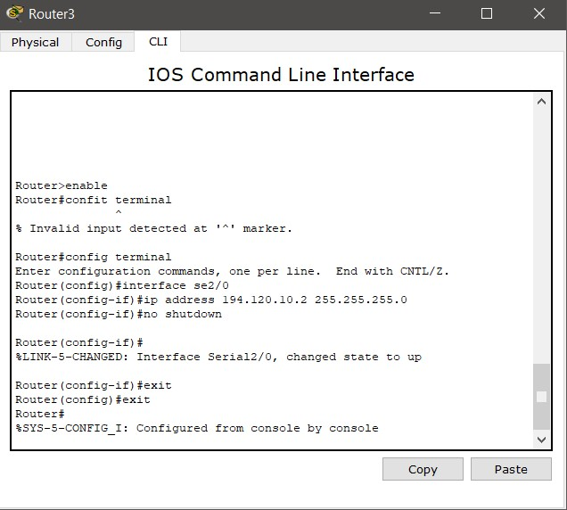

**Figure 13:** Static route entries

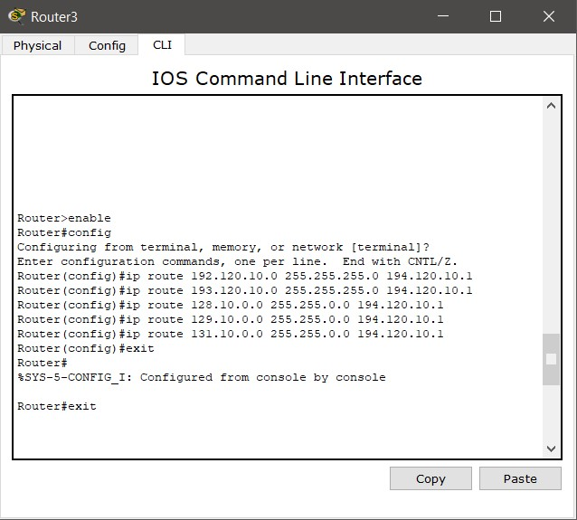

---

## Connectivity Verification — Ping Results

> **Note:** 25% first-packet loss is normal in Cisco Packet Tracer — first packet triggers ARP resolution. Subsequent packets succeed normally.

**Figure 14:** PC0 (Main) → 129.10.1.x and 129.10.2.x cross-campus

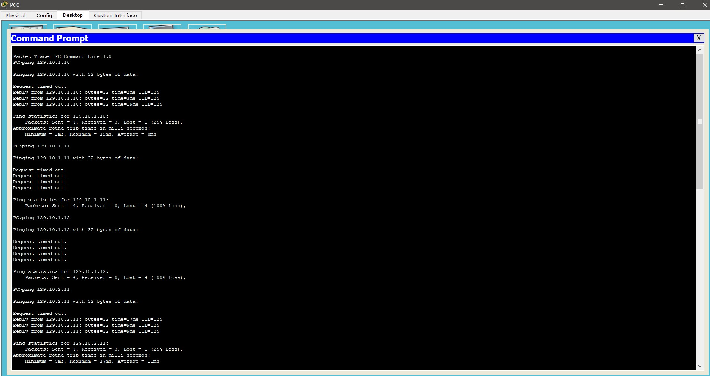

**Figure 15:** PC1 (Main) → 130.10.1.x, 130.10.2.x, 130.10.3.x

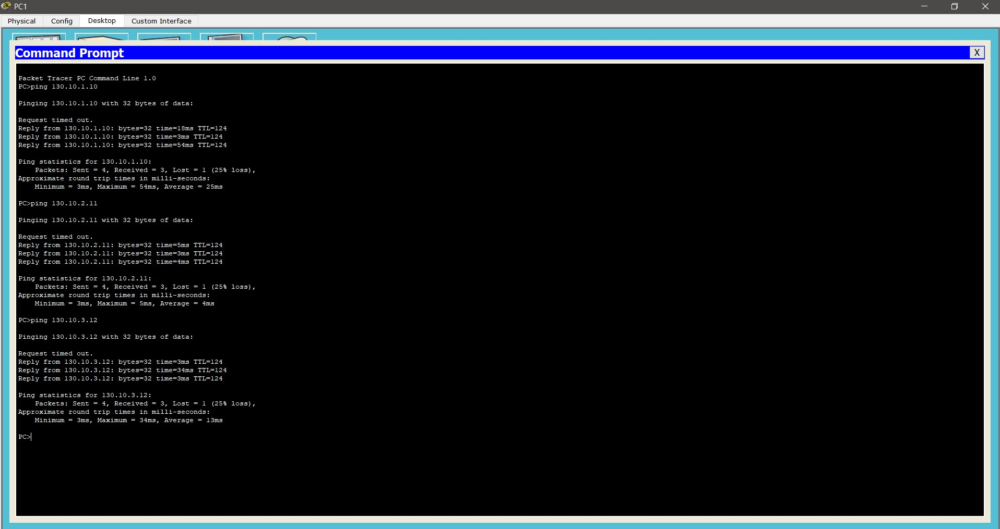

**Figure 16:** PC6 (South) → 128.10.1.x, 128.10.2.x, 128.10.3.x — 0% packet loss

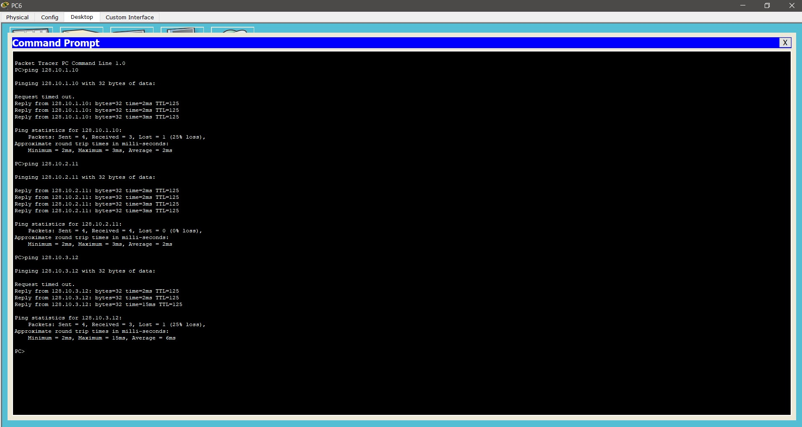

**Figure 17:** PC11 (South) → 131.10.1.x and 131.10.3.x cross-campus

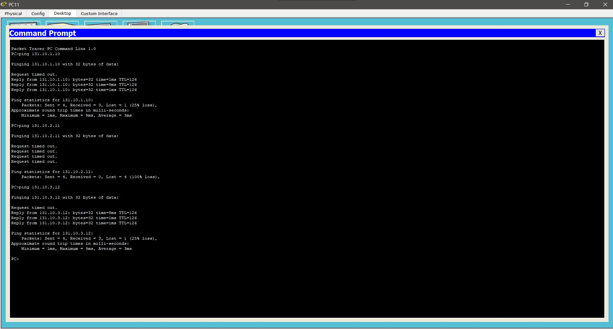

**Figure 18:** PC19 → 129.10.5.x, 129.10.6.x, 129.10.1.x — 0% loss on two targets

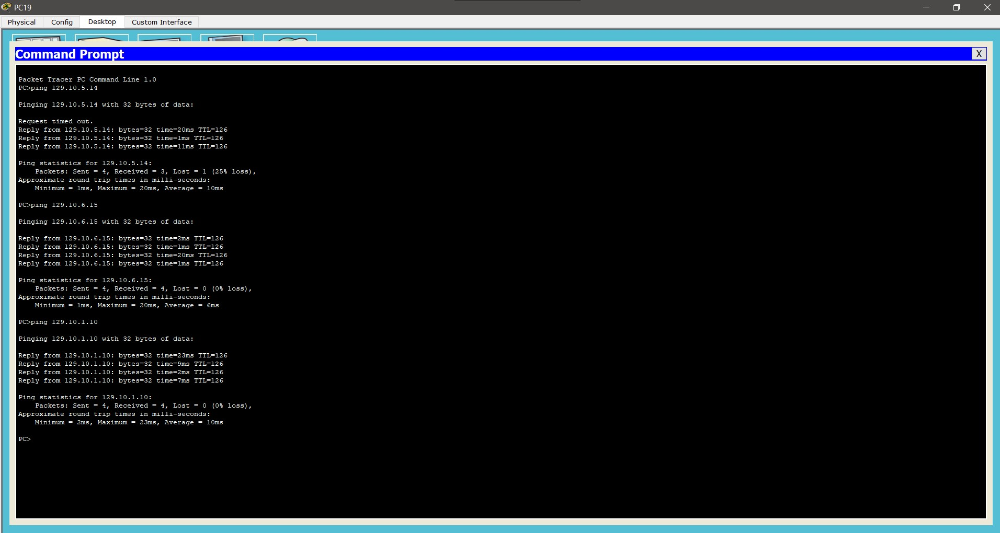

**Figure 19:** PC22 (East) → 128.10.1.x and 128.10.3.x — 0% loss confirmed

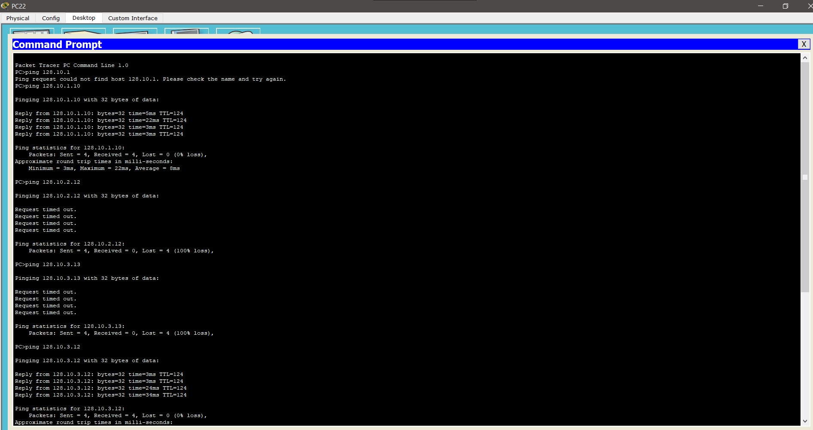

**Figure 20:** PC14 (North) cross-campus pings — routing issue detected on 130.10.x targets

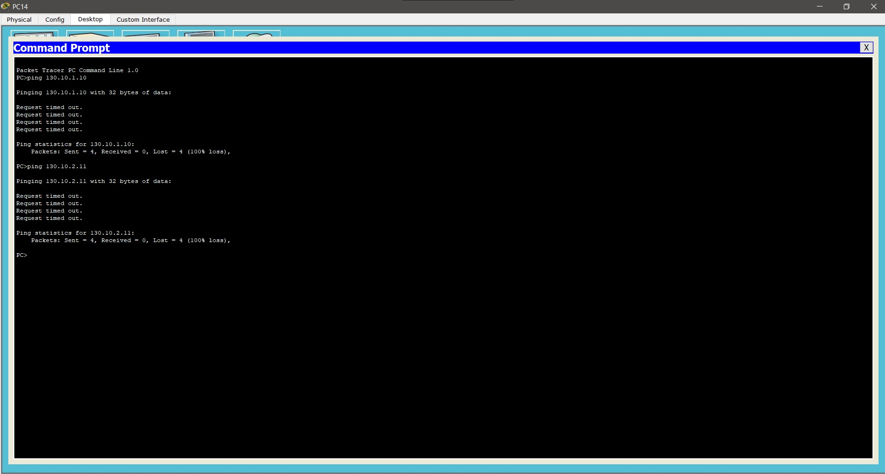

**Figure 21:** PC17 (North) → 129.10.3.x, 129.10.5.x, 129.10.4.x — 0% loss on two targets

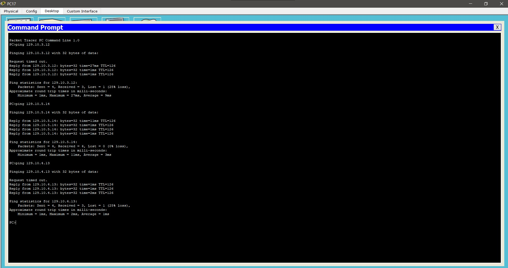

---

## Conclusion

Project successfully designed and implemented a multi-campus routed network for Avalon University in Cisco Packet Tracer.

- **4 campus LANs** — each with dedicated router + switch
- **Class B** (128–131.10.0.0/16) for internal campus traffic
- **Class C** (192–194.120.10.0/24) for serial WAN links
- **Static routing** manually configured on all 4 routers
- **Cross-campus connectivity verified** via multiple successful ping operations across ≥3 distinct LANs

Isolated 100% packet loss on some targets was due to inactive hosts in simulation — not routing failure. Routes are correctly configured as confirmed by successful pings to neighboring hosts in the same subnet.

---

## Tools Used

- Cisco Packet Tracer (network simulation)
- Cisco IOS CLI (router configuration)
